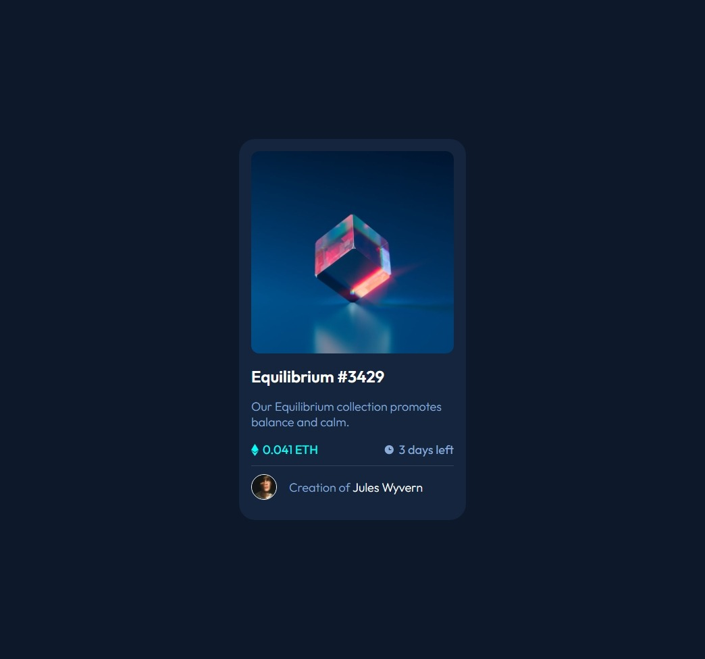

# Frontend Mentor - NFT preview card component solution

This is a solution to the [NFT preview card component challenge on Frontend Mentor](https://www.frontendmentor.io/challenges/nft-preview-card-component-SbdUL_w0U). Frontend Mentor challenges help you improve your coding skills by building realistic projects. 

## Table of contents

- [Overview](#overview)
  - [The challenge](#the-challenge)
  - [Screenshot](#screenshot)
  - [Links](#links)
- [My process](#my-process)
  - [Built with](#built-with)
  - [What I learned](#what-i-learned)
  - [Continued development](#continued-development)
  - [Useful resources](#useful-resources)
- [Author](#author)
- [Acknowledgments](#acknowledgments)

## Overview

### The challenge

Users should be able to:

- View the optimal layout depending on their device's screen size
- See hover states for interactive elements

### Screenshot



### Links

- Live Site URL: [See the demo on Github Pages](https://jimi-s-frontend-mentor-cs.github.io/NFT-Preview-Card-Component/)

## My process

### Built with

- Semantic HTML5 markup
- Flexbox
- SASS
- Mobile-first workflow

### What I learned

I learned how to use SASS without using a framework. Specifically how to compile it within VSCode and how to properly use its rules, like nested selectors and mixins.

I also learned how to apply an overlay to an image using just CSS

```hmtl

<div class="nft-image">
    
    <div class="overlay"></div>
</div>

```

```css

.nft-image {
    width: 100%;
    position: relative;

    img {
        width: inherit;
        border-radius: 1em;
    }

    .overlay {
        position: absolute;
        top: 0;
        bottom: 0;
        left: 0;
        right: 0;
        border-radius: 1em;
        height: 100%;
        opacity: 0;
        transition: .5s ease;
        background-image: url("../img/icon-view.svg");
        background-repeat: no-repeat;
        background-position: center;
        background-color: rgba(red($clrCyan), green($clrCyan), blue($clrCyan), .5);
        
        &:hover,
        &:focus,
        &:active {
            cursor: pointer;
            transition: .5s ease;
            opacity: 1;
        }
    }
}

```

### Continued development

I want to learn more about SASS and all its potential. Also want to learn more about flexbox, as some positioning I made (especially with the image) I think can be improved.

### Useful resources

- [This StackOverflow Answer](https://stackoverflow.com/a/24432110/2695796) - This helped me adding the Image overlay
- [Kevin Powell](https://www.youtube.com/kepowob) - This amazing guy helped me A TON getting me back into Web Development, refreshing by knowledge and also teaching me new stuffs and tricks (especially with CSS and flexbox).

## Author

- Frontend Mentor - [@JimiIT92](https://www.frontendmentor.io/profile/JimiIT92)

## Acknowledgments

Big shoutout to [Sebastien Lorber](https://stackoverflow.com/a/24432110/2695796) and [Kevin Powell](https://www.youtube.com/kepowob) for sharing their solutions and resources to the public, so other developers like me can learn new stuff!